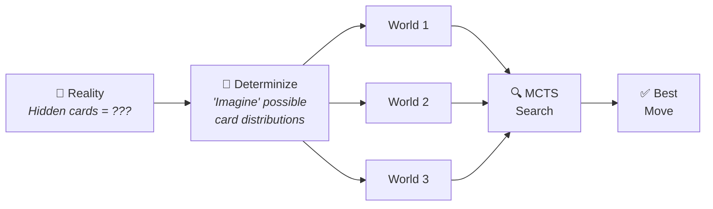
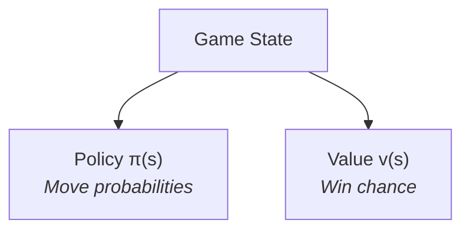
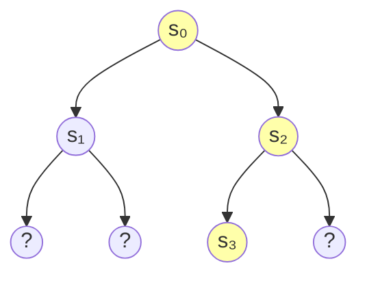
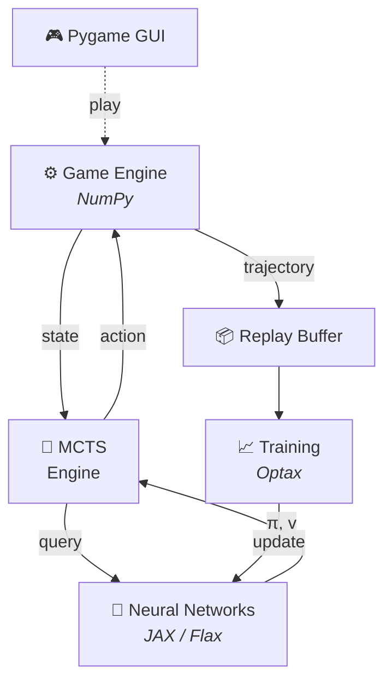

# AlphaZero in the Game of Pan


**AlphaZero** made history by defeating world champions at Chess and Go, learning entirely through **self-play** with no human expert knowledge required. This project applies the same approach to **Pan** — a Polish card game with hidden information.


## What is Pan?

**A Polish Card Game:**

- 2–4 players, 24 cards (9 through Ace)
- **Goal:** Be first to empty your hand
- Last one with cards loses

**Key Mechanics:**

- Play cards of equal or higher rank than the one on the table
- If you can't or don't want to play, take up to 3 cards
- If you have 4 cards of the same rank, you can play them at once

> *You only see your own cards!*

### The Spade Twist

Playing a **♠ Spade** **reverses** the turn order!

**Strategic Implications:**

- Skip opponents about to win
- Force others to take cards
- Chain reversals for chaos
- Timing is everything

*The AI must learn to exploit this.*

---

## Our Solution

### The AlphaZero Approach

**No Human Teachers:**

- Starts knowing only the rules
- Plays millions of games against itself
- Learns what works through trial and error

**Two Neural Networks:**

- **Policy Network:** *"What should I play?"*
- **Value Network:** *"Who's winning?"*

### Adapting to Imperfect Information

**The Problem:** AlphaZero was designed for games where you see everything. In Pan, opponent cards are *hidden*.



**Our Solution: *Determinization***

- Sample multiple "possible worlds" consistent with what we know
- Search each world as if it were real
- Aggregate the results to make a robust decision

### Neural Networks & MCTS



**MCTS (Monte Carlo Tree Search):**

- Balance exploration vs exploitation
- Use networks to guide search
- Configurable simulation count



*Select the best path through the game tree.*

---

## System Architecture



### Tech Stack

| Layer | Technologies |
|-------|-------------|
| **GUI** | Pygame |
| **ML** | MCTS + Neural Networks |
| **Framework** | JAX / Flax / Optax |
| **Game Engine** | NumPy |
| **Tooling** | uv · just · ruff · pyright · WandB |

---

## Technical Achievements

### Modern Python (3.12)

- Type hints throughout the codebase
- New `type` alias syntax
- Dataclasses for clean state management

### Configuration

- **Pydantic** for validation
- **YAML** config files
- No magic constants in code

### Developer Experience

- `uv` — fast package management
- `just` — task runner
- `ruff` — linting & formatting
- `pyright` — static type checking

### Quality Assurance

- GitHub Actions CI/CD
- Pytest for unit tests
- WandB for experiment tracking

### Game Interface

- Full graphical interface with **Pygame**
- Click to play cards from your hand
- AI opponents think in real-time
- Visual feedback for legal moves
- Card highlighting for valid actions
- Multi-card selection (four-of-a-kind)
- Turn indicators and game status

---

## Getting Started

### Prerequisites

- Python ≥ 3.12
- [uv](https://github.com/astral-sh/uv) package manager
- [just](https://github.com/casey/just) command runner

### Installation

```bash
just install
```

To install the ML dependencies (JAX, Flax, Optax) for training:

```bash
uv sync --group ml
```

### Play Against the AI

```bash
just play
```

### Train from Scratch

```bash
just train
```


## Configuration

All parameters are configurable through YAML files in `configs/`.

### Training (`configs/default.yaml`)

| Parameter | Default | Description |
|-----------|---------|-------------|
| `learning_rate` | `1e-4` | Optimizer learning rate |
| `batch_size` | `32` | Training batch size |
| `epochs` | `100` | Number of training epochs |
| `num_simulations` | `128` | MCTS simulations per move |
| `num_worlds` | `8` | Parallel determinized worlds |
| `player_count` | `4` | Number of players |
| `max_buffer_size` | `1024` | Replay buffer capacity |

### Play (`configs/play.yaml`)

| Parameter | Default | Description |
|-----------|---------|-------------|
| `num_simulations` | `64` | MCTS simulations per move |
| `num_worlds` | `4` | Parallel determinized worlds |
| `policy_temp` | `0.0` | Greedy play for AI |
| `player_count` | `4` | Number of players |
| `human_player` | `0` | Human player index |

Custom configs can be passed via:

```bash
just train configs/my_custom.yaml
just play configs/my_custom.yaml
```

---

## Configurability & Extensibility

- **Modular design** — swap components easily
- **WandB integration** for experiment comparison
- **Checkpoint saving/loading** for long training runs
- **Framework prepared** for distributed training
